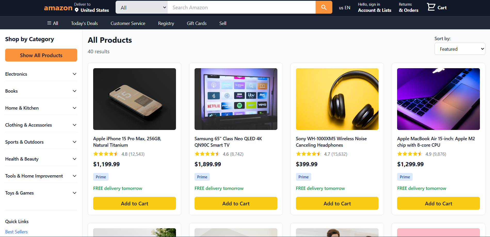
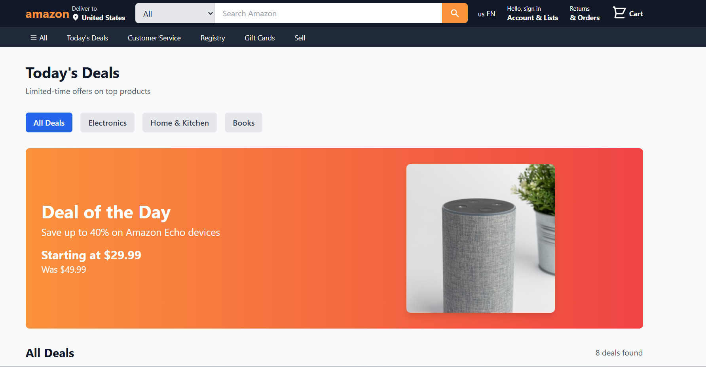
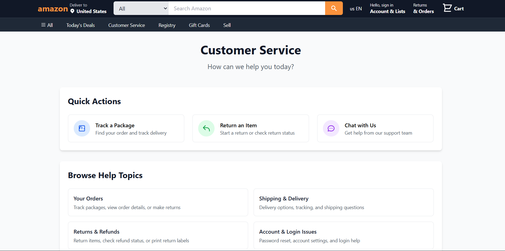
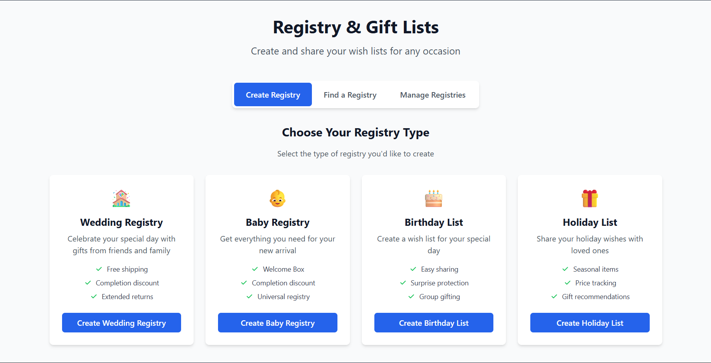
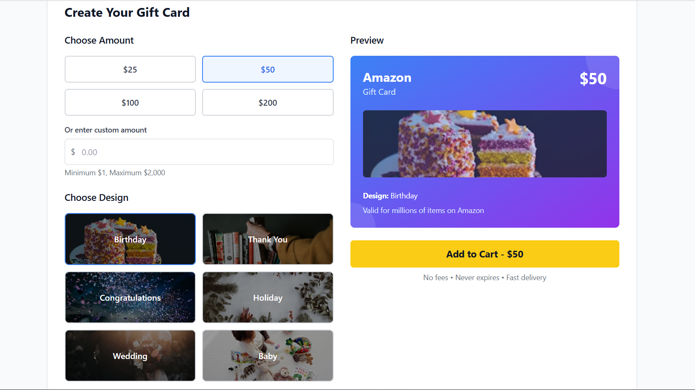
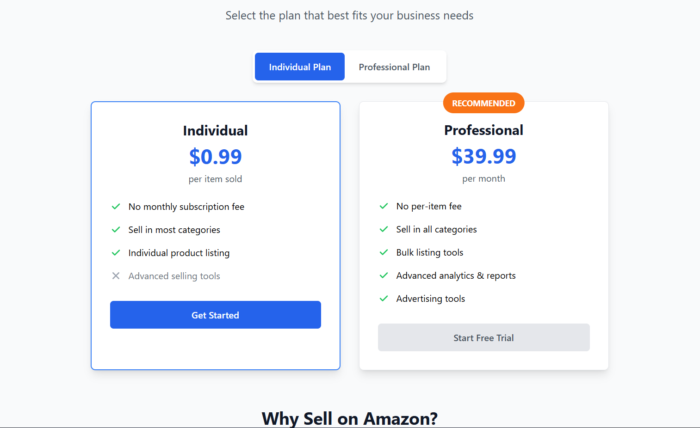

# 🛍️ Amazon Clone - Full-Stack E-Commerce Platform

<div align="center">



[](https://yaser-123.github.io/Amazon-Clone/)
[](https://github.com/Yaser-123/Amazon-Clone/stargazers)
[](https://github.com/Yaser-123/Amazon-Clone/network/members)
[](https://github.com/Yaser-123/Amazon-Clone/issues)

### 📱 **Quick Access QR Code**
<table>
<tr>
<td align="center">

<br>
<strong>📲 Scan to Visit Live Site</strong>
<br>
<em>Point your phone camera at the QR code</em>
</td>
</tr>
</table>

*A pixel-perfect, fully responsive Amazon clone built with modern React technologies*

</div>

---

## 🎯 Project Overview

This is a comprehensive Amazon e-commerce platform clone that replicates the core functionality and user experience of Amazon.com. Built with React 18 and modern web technologies, it features a complete shopping experience with product browsing, cart management, deals section, and multiple service pages.

## ✨ Key Features

### 🛒 **E-Commerce Core**
- **Product Catalog**: Browse 40+ carefully curated products across multiple categories
- **Smart Search**: Real-time search functionality with product filtering
- **Shopping Cart**: Add, remove, and manage cart items with persistent state
- **Category Filtering**: Browse products by Electronics, Books, Home & Kitchen

### 🎨 **User Interface**
- **Pixel-Perfect Design**: Exact recreation of Amazon's visual identity
- **Responsive Layout**: Mobile-first approach with seamless desktop experience
- **Interactive Elements**: Smooth hover effects and transitions
- **Professional UI**: Clean, modern design with Amazon's color scheme

### 📱 **Complete Page System**
- **Today's Deals**: Special offers with category-based filtering
- **Customer Service**: Comprehensive support page
- **Registry & Gifts**: Gift management system
- **Sell on Amazon**: Seller onboarding page
- **Gift Cards**: Digital gift card platform

---

## 🖼️ Screenshots

### Main Products Page


### Today's Deals Section


### Customer Service Portal


### Registry & Gifts


### Gift Cards Platform


### Amazon Subscription Services


---

## 🛠️ Tech Stack

<div align="center">

| Frontend | Styling | State Management | Routing | Deployment |
|----------|---------|------------------|---------|------------|
|  |  |  |  |  |

</div>

### � **Core Technologies**
- **React 18**: Latest version with Hooks and functional components
- **TailwindCSS**: Utility-first CSS framework via CDN
- **React Router DOM**: Client-side routing for SPA navigation
- **React Context API**: Global state management for cart functionality
- **Heroicons**: Beautiful SVG icons for UI elements

### 📦 **Development Tools**
- **Create React App**: Zero-configuration setup
- **ES6+**: Modern JavaScript features
- **CSS Grid & Flexbox**: Advanced layout techniques
- **Git & GitHub**: Version control and collaboration
- **GitHub Pages**: Automated deployment pipeline

---

## 🏗️ Project Architecture

```
amazon-clone/
├── 📁 public/
│   ├── 📄 index.html              # Main HTML template
│   ├── 📄 favicon.ico             # Site icon
│   ├── 📄 manifest.json           # PWA configuration
│   ├── 📄 robots.txt              # SEO configuration
│   └── 📁 Images/                 # README screenshots & QR code
│       ├── 🖼️ Products.png
│       ├── 🖼️ Deals.png
│       ├── 🖼️ customer_service.png
│       ├── 🖼️ registery&gifts.png
│       ├── 🖼️ creategiftcard.png
│       ├── 🖼️ subscription.png
│       └── 📱 amazon-clone-qr.png  # QR code for quick access
│
├── 📁 src/
│   ├── 📄 App.js                  # Main application component
│   ├── 📄 App.css                 # Global styles
│   ├── 📄 index.js                # React DOM entry point
│   ├── 📄 index.css               # Root CSS with Tailwind imports
│   │
│   ├── 📁 components/             # Reusable UI components
│   │   ├── 📄 Navbar.js           # Header with search & navigation
│   │   ├── 📄 Sidebar.js          # Category navigation panel
│   │   ├── 📄 ProductGrid.js      # Product display grid
│   │   ├── 📄 ProductCard.js      # Individual product cards
│   │   └── 📄 Footer.js           # Site footer with links
│   │
│   ├── 📁 pages/                  # Route-based page components
│   │   ├── 📄 Home.js             # Main landing page
│   │   ├── 📄 Cart.js             # Shopping cart page
│   │   ├── 📄 TodaysDeals.js      # Deals with filtering
│   │   ├── 📄 CustomerService.js  # Support & help page
│   │   ├── 📄 Registry.js         # Gift registry system
│   │   ├── 📄 GiftCards.js        # Digital gift cards
│   │   └── 📄 Sell.js             # Seller platform page
│   │
│   ├── 📁 context/                # Global state management
│   │   └── 📄 CartContext.js      # Shopping cart state
│   │
│   ├── 📁 data/                   # Static data files
│   │   └── 📄 products.json       # Product catalog database
│   │
│   └── 📄 setupTests.js           # Testing configuration
│
├── 📄 package.json                # Dependencies & scripts
├── 📄 package-lock.json           # Dependency lock file
├── 📄 README.md                   # Project documentation
└── 📄 .gitignore                  # Git ignore rules
```

---

## � Getting Started

### Prerequisites

Ensure you have the following installed:
- **Node.js** (v14.0.0 or higher)
- **npm** (v6.0.0 or higher) or **yarn**
- **Git** for version control

### Installation & Setup

1. **Clone the repository**
   ```bash
   git clone https://github.com/Yaser-123/Amazon-Clone.git
   cd Amazon-Clone
   ```

2. **Install dependencies**
   ```bash
   npm install
   # or
   yarn install
   ```

3. **Start development server**
   ```bash
   npm start
   # or
   yarn start
   ```

4. **Open in browser**
   Navigate to [http://localhost:3000](http://localhost:3000)

### 📦 Available Scripts

| Command | Description |
|---------|-------------|
| `npm start` | 🚀 Runs app in development mode |
| `npm test` | 🧪 Launches the test runner |
| `npm run build` | 📦 Builds app for production |
| `npm run deploy` | 🌐 Deploys to GitHub Pages |
| `npm run eject` | ⚠️ Ejects from Create React App |

---

## 🎯 Component Architecture

### 🧩 **Core Components**

#### `<Navbar />`
- Amazon logo and branding
- Location selector with geolocation
- Search bar with category dropdown
- Account menu and cart icon
- Responsive mobile navigation

#### `<Sidebar />`
- Hierarchical category navigation
- Expandable subcategories
- Quick links (Best Sellers, Deals, etc.)
- Dynamic product filtering

#### `<ProductGrid />`
- Responsive grid layout system
- Real-time category filtering
- Empty state handling
- Smooth loading animations

#### `<ProductCard />`
- Product image with fallback
- Rating stars and review count
- Price display with discounts
- Add to cart functionality

### 📄 **Page Components**

#### `<Home />`
- Hero section with featured products
- Category-based product filtering
- Search results display
- Responsive grid layout

#### `<TodaysDeals />`
- Featured deal of the day
- Category filtering (Electronics, Home & Kitchen, Books)
- Lightning deals section
- Discount badges and pricing

#### `<Cart />`
- Item management (add/remove/quantity)
- Real-time price calculation
- Checkout simulation
- Persistent cart state

---

## 🎨 Design System

### 🎯 **Color Palette**
- **Primary Orange**: `#FF9900` - Amazon's signature color
- **Dark Blue**: `#232F3E` - Navigation and headers
- **Light Gray**: `#F3F3F3` - Background and cards
- **White**: `#FFFFFF` - Content areas
- **Red**: `#B12704` - Prices and alerts
- **Yellow**: `#FFD814` - Buttons and highlights

### 📱 **Responsive Breakpoints**
- **Mobile**: `< 768px`
- **Tablet**: `768px - 1024px`
- **Desktop**: `> 1024px`
- **Large Desktop**: `> 1280px`

### 🔤 **Typography**
- **Primary Font**: Amazon Ember, Arial, sans-serif
- **Headings**: Bold weights (600-700)
- **Body Text**: Regular weight (400)
- **Small Text**: Light weight (300)

---

## 🌐 Deployment

### Automated Deployment
This project uses GitHub Actions for continuous deployment to GitHub Pages. Every push to the `main` branch automatically triggers a new deployment.

### Manual Deployment

1. **Build for production**
   ```bash
   npm run build
   ```

2. **Deploy to GitHub Pages**
   ```bash
   npm run deploy
   ```

3. **Access live site**
   Visit: [https://yaser-123.github.io/Amazon-Clone/](https://yaser-123.github.io/Amazon-Clone/)

---

## 🔮 Future Enhancements

### 🎯 **Phase 1: Backend Integration**
- [ ] User authentication system
- [ ] Real database integration
- [ ] Payment processing
- [ ] Order management

### 🎯 **Phase 2: Advanced Features**
- [ ] Product reviews and ratings
- [ ] Wishlist functionality
- [ ] Advanced search filters
- [ ] Recommendation engine

### 🎯 **Phase 3: Performance & SEO**
- [ ] Server-side rendering (Next.js)
- [ ] Image optimization
- [ ] Advanced caching strategies
- [ ] SEO optimization

---

## 🤝 Contributing

We welcome contributions from the community! Here's how you can help:

### 🛠️ **How to Contribute**

1. **Fork the repository**
2. **Create a feature branch**
   ```bash
   git checkout -b feature/amazing-feature
   ```
3. **Make your changes**
4. **Commit your changes**
   ```bash
   git commit -m 'Add amazing feature'
   ```
5. **Push to the branch**
   ```bash
   git push origin feature/amazing-feature
   ```
6. **Open a Pull Request**

### � **Contribution Guidelines**
- Follow existing code style and conventions
- Write clear, descriptive commit messages
- Add comments for complex logic
- Test your changes thoroughly
- Update documentation if needed

---

## �📄 License

This project is licensed under the **MIT License** - see the [LICENSE](LICENSE) file for details.

### ⚖️ **License Summary**
- ✅ Commercial use
- ✅ Modification
- ✅ Distribution
- ✅ Private use
- ❌ Liability
- ❌ Warranty

---

## 🙏 Acknowledgments

### 💡 **Inspiration & Resources**
- [Amazon.com](https://amazon.com) - Original design inspiration
- [React Documentation](https://reactjs.org/) - Comprehensive React guides
- [TailwindCSS](https://tailwindcss.com/) - Utility-first CSS framework
- [Heroicons](https://heroicons.com/) - Beautiful SVG icons
- [Unsplash](https://unsplash.com/) - High-quality product images

### 🏆 **Special Thanks**
- The React team for creating an amazing framework
- The open-source community for continuous inspiration
- All contributors who help improve this project

---

## 📞 Contact & Support

<div align="center">

### 👨‍💻 **Developer**

**Yaser Mohammed**

[](https://github.com/Yaser-123)
[](https://linkedin.com/in/yaser-profile)
[](mailto:yaser@example.com)

### 🔗 **Project Links**

[](https://github.com/Yaser-123/Amazon-Clone)
[](https://yaser-123.github.io/Amazon-Clone/)
[](https://github.com/Yaser-123/Amazon-Clone/issues)

</div>

---

<div align="center">

### ⭐ **If you found this project helpful, please give it a star!** ⭐

*This project is for educational purposes and is not affiliated with Amazon.com, Inc.*

**Made with ❤️ and React**

</div>
